# Project_actiTime_Ninad
Project on actitime automation
# This project is not completed yet

# Index
1.  [Prerequisite](#prerequisite)
2.  [Steps to run project](#stepstorun)
3.  [Test cases and Output(video)](#outputs)


*************************************************
# Prerequisite

1.  [Java](#prerequisite)
2.  [Eclipse](#eclipse)
3.  [Selenium](#selenium)
4.  [ChromeDriver](#chromedriver)
5.  [DataDrivenFramework](#datadrivenframework)
6.  [TestNG](#testng)


**********************

## java
To download java <a href="https://www.oracle.com/java/technologies/downloads/">click here</a>

*******************************

## Eclipse
To download Eclipse <a href="https://www.eclipse.org/downloads/">click here</a> 

******************************

## Selenium
1. To download Selenium <a href="https://www.selenium.dev/downloads/">click here</a> and click on latest stable version


2. After downloading create a folder in java project named as **"jar"**.
3. Copy-Paste .jar file in **"jar"** folder.
4. Select .jar file -> Right click -> Go to build path -> Click on add to build path.

*****************************************

## ChromeDriver

1. To download ChromeDriver <a href="https://chromedriver.chromium.org/">click here</a> and click on latest stable version

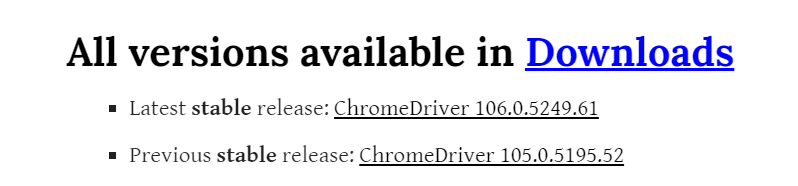

2. After downloading create a folder in java project named as **"driver"**.
3. Copy-Paste chromedriver.exe file in **"driver"** folder.
******************************************************

## DataDrivenFramework
### STEPS to download POI
- To download POI follow this steps:-
1. Go to Google and type POI jar file download and select first link or <a href="https://poi.apache.org/download.html"> Click Here</a>.

    ```
        https://poi.apache.org/download.html
    ```

2. Under Binary distribution click on **`.zip`** link.

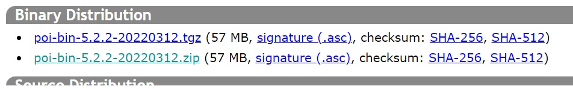

3. Click on suggested link for download. The zip file gets downloaded automatically.

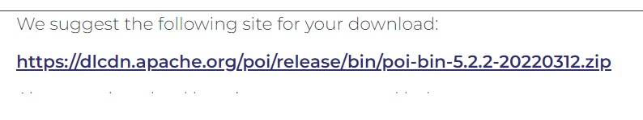

4. Extract the zip file.

5. Copy paste all jar file from folders and subfolders into jar folder of eclipse.

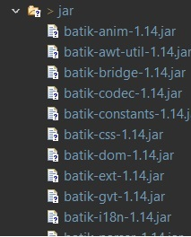

6. Select all .jar files -> Right click -> Go to build path -> Click on add to build path.

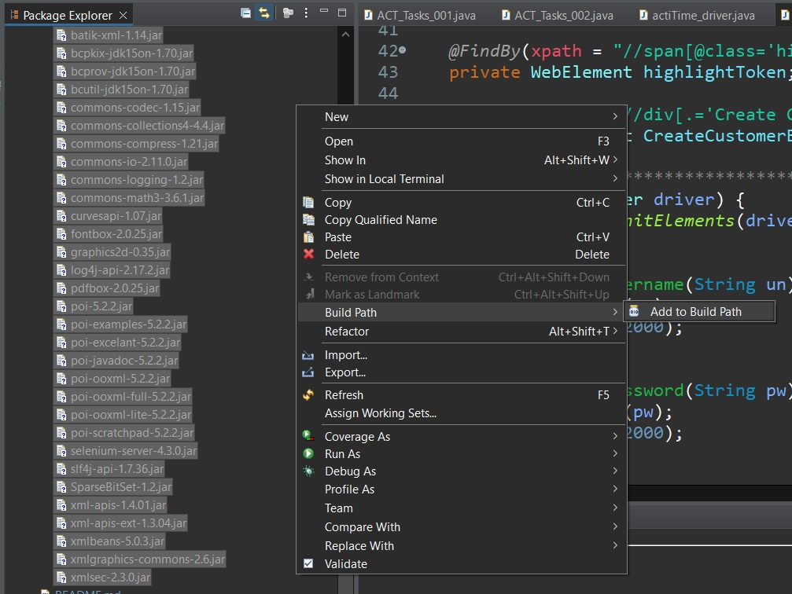

7. Create folder called **`data`** in java project and copy-paste excel sheet.

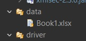

8. Type **USERNAME** and **PASSWORD** in excel sheet and give sheet name as `input`.

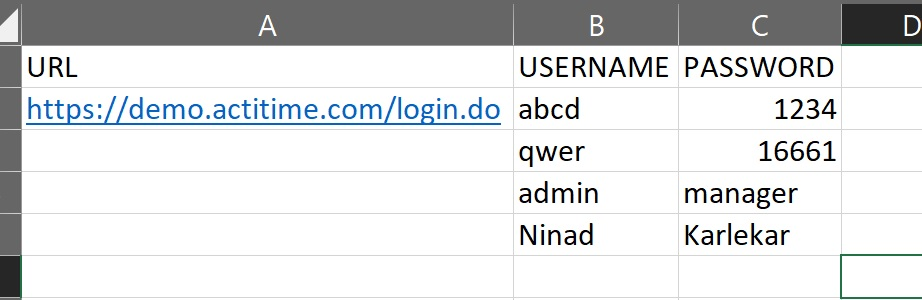

*************************************************
************************************
*********************************
## TestNG

1.  [TestNG_Installation](#TestNG_Installation)
2.  [TestNG_Configuration](#TestNG_Configuration)

## TestNG_Installation
Steps:-
1. Open Eclipse and create java project
2. Go to **Help** -> **Eclipse marketplace**

    

3. Type **testNG for eclipse** in searchbox and install.

    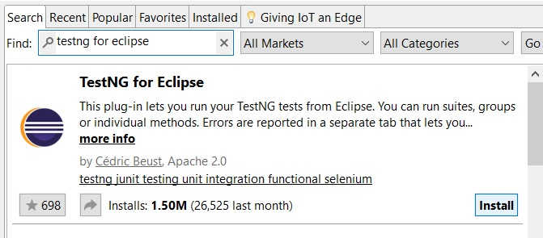

4. During Midway of installation we get a popup. Click on install anyway and after installing restart eclipse.

    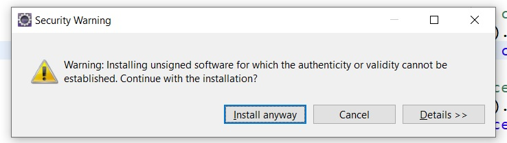

-----------------
**If this is not working try these steps:-**

1. click on Help menu -> Click on Install new software.

2. In popup click on add button. We get add repository popup.

3. Type TestNG in **name** textfield and paste following link in **location** textfield
    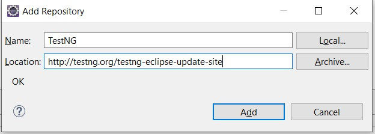

```
https://testng.org/testng-eclipse-update-site
```


4. Select TestNG Checkbox and click on next and finish.

5. During Midway of installation we get a popup. Click on install anyway and after installing restart eclipse.

    


******************************

## TestNG_Configuration

1. Right click on java project -> build path -> add libraries

    

2. Select TestNG from popup click on next and finish.

    

3. By doing this the TestNG library is added into project.

*************************************************
************************************
*********************************

# StepsToRun

1. Download and open project in **Eclipse**.
2. Go to **actitime** project -> **src** -> Right click on **actitime_testscripts** -> **TextNG** -> **Convert to TestNG**

    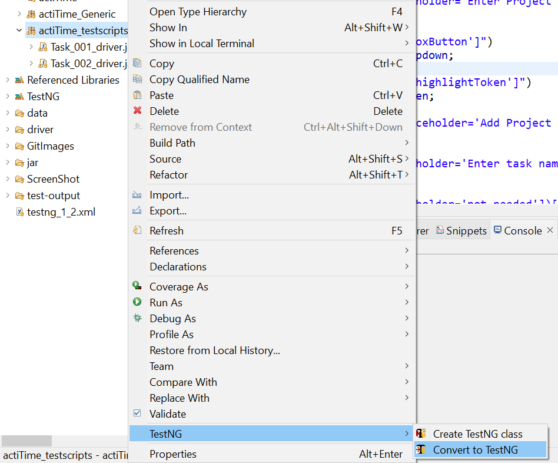

3. Enter Suite name & Test name -> click on finish.
4. Right click on newly generated **.xml** file -> **Run as** -> **TestNG Suite**.

    

5. If you want to change Order of Execution of programs then, Right click on **.xml** file -> Open with -> **Text editor**
6. Change the order of execution in .xml file (Changes should be in between `<classes>` & `</classes>` only)

    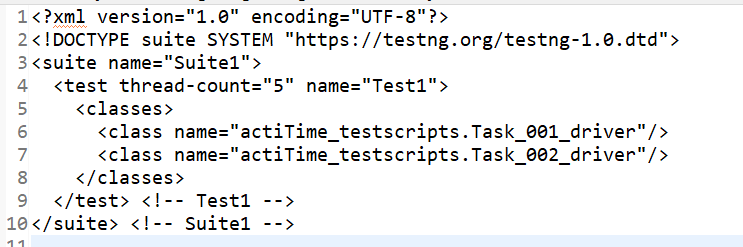


-------------------------------------------------
----------------------------------------------
------------------------------------------------

# Outputs

<details>
<summary> <b>Tasks</b> </summary>

<!-- *    <details>
     <summary>Task 001</summary>

     ````md  
        Task 001

        1.Launch the browser
        2.Enter the url
        3.Enter username
        4.Enter the password
        5.Click on 'Tasks' in Menu bar
        6.Click on '+ Add New' in Tasks
        7.Click on 'New Task' in '+ Add New' drop down list
        8.Click on 'Select Customer' drop down under 'Details' in Create New Task page (1st Dropdown)
        9.Click on 'any customer' from drop down in Create New Task page
        10.Click on 'Select Project' drop down under 'Details' in Create New Task page (2nd Dropdown)
        11.Click on 'any project' from drop down in Create New Task page
        12.Click on 'Enter Task Name' text field in in Create New Task page
        13.Enter task name in 'Enter Task Name' text field in Create New Task page
        15.Click on 'Estimate' text field in Create New Task page
        16.Click on 'Deadline' text field in Create New Task page
        17.Click on Checkbox in Create New Task page
        18.'Click on '+ Create Task 'button.in Create New Project page
     ````

     https://user-images.githubusercontent.com/88243315/197594694-76226355-d375-4461-bae7-c757b652f6fc.mp4
     </details>


*    <details>
     <summary>Task 002</summary>

     ````md  
        Task 002

        1.Launch the browser
        2.Enter the url
        3.Enter username
        4.Enter the password
        5.Click on 'Tasks' in Menu bar
        6.Click on '+ Add New' in Tasks
        7.Click on 'New Task' in '+ Add New' drop down list
        8.Click on 'Select Customer' drop down under 'Details' in Create New Task page (1st Dropdown)
        9.Click on 'any customer' from drop down in Create New Task page
        10.Click on 'Select Project' drop down under 'Details' in Create New Task page (2nd Dropdown)
        11.Click on 'any project' from drop down in Create New Task page
        12.Click on 'Enter Task Name' text field in in Create New Task page
        13.Enter task name in 'Enter Task Name' text field in Create New Task page
        15.Click on 'Estimate' text field in Create New Task page
        16.Click on 'Deadline' text field in Create New Task page
        17.Click on Checkbox in Create New Task page
        18.'Click on '+ Create Task 'button.in Create New Project page
     ````

     https://user-images.githubusercontent.com/88243315/197594694-76226355-d375-4461-bae7-c757b652f6fc.mp4
     </details> -->


*    <details>
     <summary>Task 003</summary>

     ````md
        Task 003

        1.Launch the browser
        2.Enter the url
        3.Enter username
        4.Enter the password
        5.Click on 'Tasks' in Menu bar
        6.Click on '+ Add New' in Tasks
        7.Click on 'New Task' in '+ Add New' drop down list
        8.Click on 'Select Customer' drop down under 'Details' in Create New Task page (1st Dropdown)
        9.Click on 'any customer' from drop down in Create New Task page
        10.Click on 'Select Project' drop down under 'Details' in Create New Task page (2nd Dropdown)
        11.Click on 'any project' from drop down in Create New Task page
        12.Click on 'Enter Task Name' text field in in Create New Task page
        13.Enter task name in 'Enter Task Name' text field in Create New Task page
        15.Click on 'Estimate' text field in Create New Task page
        16.Click on 'Deadline' text field in Create New Task page
        17.Click on Checkbox in Create New Task page
        18.'Click on '+ Create Task 'button.in Create New Project page
     ````

     https://user-images.githubusercontent.com/88243315/197594694-76226355-d375-4461-bae7-c757b652f6fc.mp4
     </details>


</details>

<!-- ## Tasks
<details>
  </br>

  - [X] Item1
  - [ ] Item2
  - [ ] Item3

</details> -->


